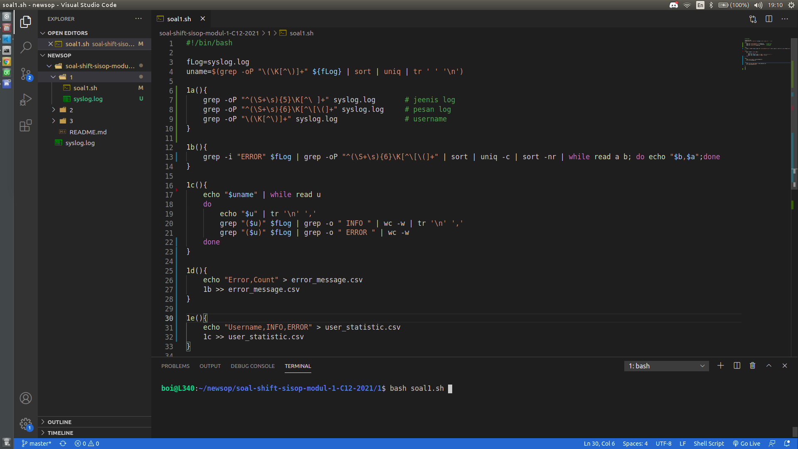
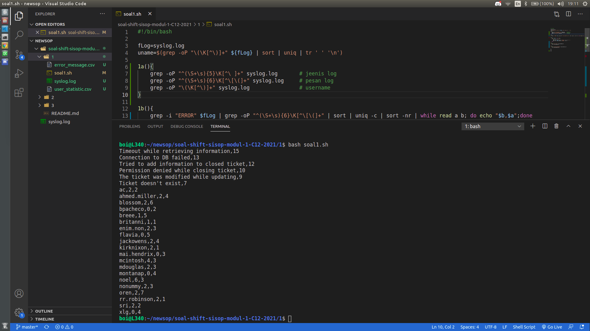
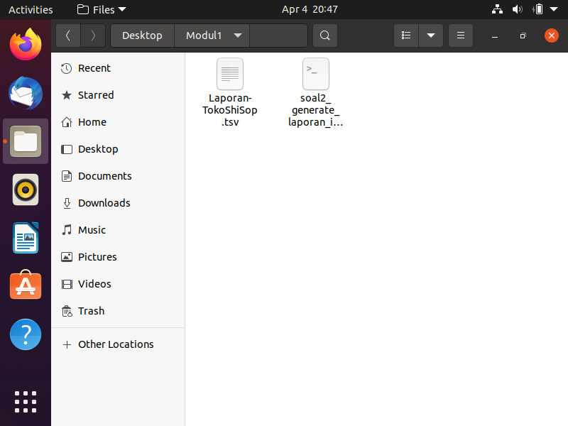
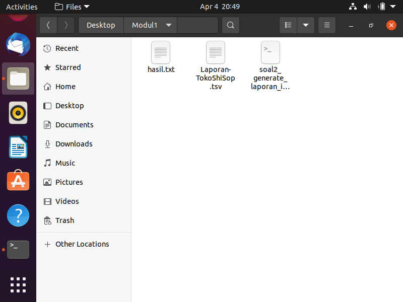
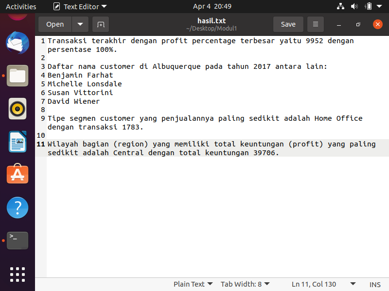
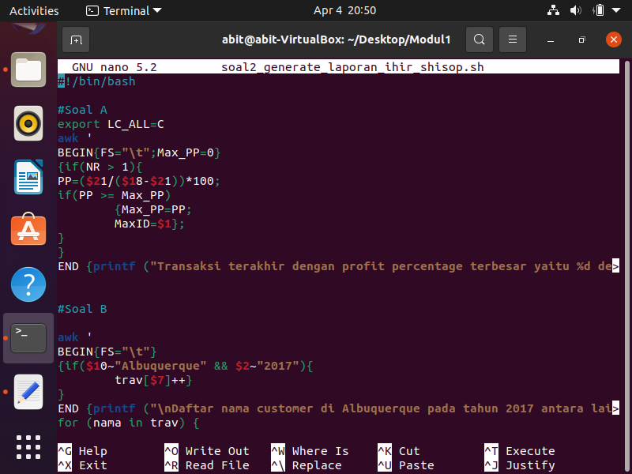
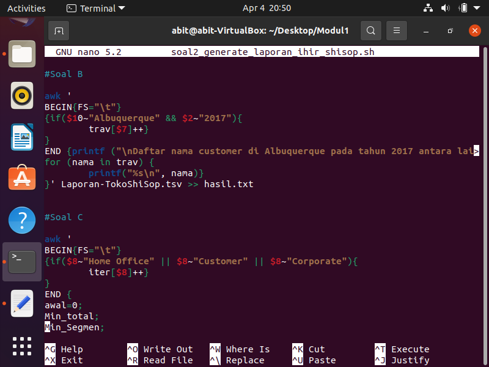
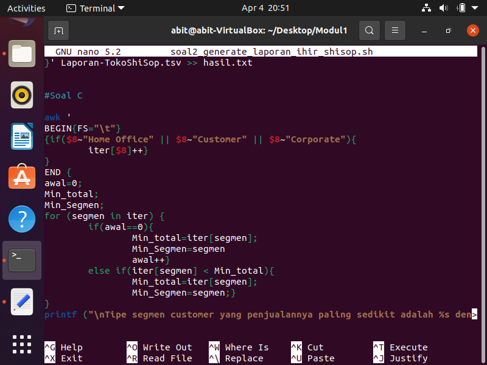
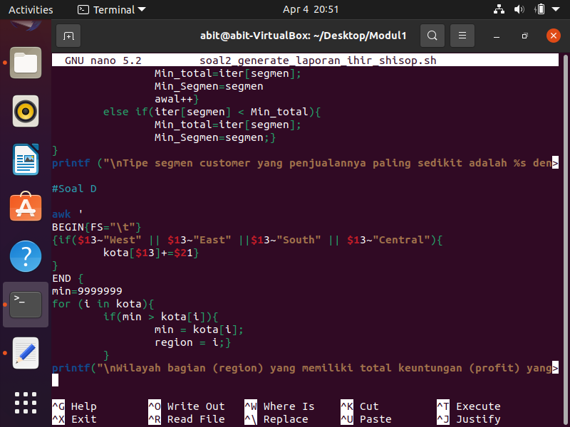

# LAPORAN PENJELASAN SOAL SHIFT MODUL 1
## Anggota
- Mohammad Faderik Izzul Haq (05111940000023)
- Jonathan Timothy Siregar (05111940000120)
- Abiya Sabitta Ragadani (05111940000166)

### SOAL 1
<p align="center">
	
	<br>
	Gambaran program dan struktur folder SEBELUM dijalankan
	<br>
</p>
<p align="center">
	
	<br>
	Gambaran program dan struktur folder SETELAH dijalankan
	<br>
</p>

#### Kendala yang dihadapi
Ketika pengerjaan soal nomer 1 ini, kami belum pernah mengerjakan regex sebelumnya. Jadi diperlukan adaptasi yang cukup memakan waktu untuk memahami regex. Selain itu ada kesalah pahaman bahwa sub soal B dan C yang seharusnya ditampilkan  ke terminal, kami anggap hanya perlu ditampilkan di file output.

#### PenejSub Soal A
Sub soal ini meminta kita untuk membuat regex untuk mengekstrak informasi dari file syslog.log. disini kami menggunakan bantuan command `grep -oP`. flag -o berfungsi supaya grep hanya menampilkan kata yang sama dengan patternyang ditentukan, -P berarti menginterpretasikan patern dengan 'Perl-compatible  regular  expressions  (PCREs)' untuk dapat menggunakan pattern regex.

1. Jenis log : `grep -oP "^(\S+\s){5}\K[^\ ]+" syslog.log`.
Untuk menemukan jenis log disini digunakan pattern menggunakan regex untuk mencari kata dan spasi sebanyak 5 kali, lalu melupakan kata yang sudah ditemukan sebelumnya. Lalu grep mengambil semua karakter hingga bertemu spasi.

2. Pesan log : `grep -oP "^(\S+\s){6}\K[^\[\(]+" syslog.log`.
Pada pattern yang digunakan disini, pertama regex akan mencari kata dan spasi sebanyak 6 kali. Lalu perintah \K akan melupakan semua yang sudah ditemukan sebelumnya. Selanjutnya grep akan mengambil semua karakter hingga bertemu kakrakter '[' atau '('.

3. Username : `grep -oP "\(\K[^\)]+" syslog.log`.
Pada soal ini pattern yang menggunakan regex untuk mencari karakter '(' , setelah menemukan posisi karakter '(', \K akan melupakan semua karakter yang ditemukan. Lalu grep akan mengambil semua karakter hingga bertemu karakter ')'

#### Sub Soal B
Pada soal ini diminta untuk menampilkan semua pesan error beserta jumlah kemunculannya. Command yang yang digunakan adalah `grep -i "ERROR" $fLog | grep -oP "^(\S+\s){6}\K[^\[\(]+" | sort | uniq -c` disini grep akan mencari baris yang mengandung karakter "ERROR" lalu dari hasil yang diperoleh akan dilakukan grep lagi dengan pattern regex. Perintah regex disini sama dengan perintah pada sub soal A. Setelah memperoleh semua pesan error, dilakukan `sort | uniq -c` yang berfungsi untuk menghitung jumlah kemunculan pesan error yang unik. Sehingga pesan error yang sama tidak akan terhitung lebih dari sekali.

#### Sub Soal C
Soal ini meminta program untuk menampilkan jumlah kemunculan log ERROR dan INFO untuk setiap user-nya. Disini kami menggunakan program sebagai berikut :
````Shell
uname=$(grep -oP "\(\K[^\)]+" ${fLog} | sort | uniq | tr ' ' '\n')

echo "$uname" | while read u
do
echo "$u" | tr '\n' ','
	grep "($u)" $fLog | grep -o " INFO " | wc -w | tr '\n' ','
	grep "($u)" $fLog | grep -o " ERROR " | wc -w 
done
````
Pertama kita mencari semua username yang terdapat pada file log dan menghapus username yang sama. Lalu kita memisahkan antar username dengan \n dan menyimpannya dalam variabel uname. Selanjutnya setiap baris dari variabel uname akan dibaca oleh perintah while dan disimpan sebagai `u`, dan setiap iterasi tersebut dilakukan grep dari file log untuk mencari baris yang mengandung username `u`, hasil dari perintah tersebut dilakukan perintah grep lagi untuk mencari karakter "INFO" dan menghitung jumlah kemunculannya dengan wc. Untuk mencari jumlah kemunculan karakter "ERROR" dilakukan hal yang sama hanya perlu mengganti "INFO" dengan "ERROR".

#### Sub Soal D
Pada soal ini kita diminta menyimpan hasil dari sub soal B pada file `error_message.csv` dengan header Error,Count. Hasil dari pesan error dan kemunculannya perlu diurutkan berdasarkan jumlah kemunculannya dari terbanyak hingga terkecil.
````Shell
echo "Error,Count" > error_message.csv
grep -i "ERROR" $fLog | grep -oP "^(\S+\s){6}\K[^\[\(]+" | sort | uniq -c | sort -nr | while read a b; do echo "$b,$a";done >> error_message.csv
````
Pertama kita membuat header "Error,Count" dan menyimpannya pada file output yang diminta. Selanjutnya kita mencari pesan error dan jumlah kemunculannya sesuai dengan Sub Soal B. Namun pada soal ini kita perlu mengurutkan hasilnya sesuai jumlah kemunculannya, maka kita lakukan `sort -nr` untuk mengurutkan angka dalam string. Untuk menyesuaikan bentuk output dengan format yang diminta, kita perlu membalik posisi pesan error dengan jumlah nya. Setelah semua perintah telah dijalankan, hasil output dari perintah tersebut dimasukkan pada file output dengan sistem append, sehingga header yang sebelumnya sudah kita buat tidak hilang.

#### Sub Soal E
Disini kita menampilkan semua informasi yang diperoleh pada Sub Soal C ke file user_statistic.csv urut berdasar username secara ascending.
````Shell
uname=$(grep -oP "\(\K[^\)]+" ${fLog} | sort | uniq | tr ' ' '\n')

echo "Username,INFO,ERROR" > user_statistic.csv
echo "$uname" | while read u
do
	echo "$u" | tr '\n' ','
	grep "($u)" $fLog | grep -o " INFO " | wc -w | tr '\n' ','
	grep "($u)" $fLog | grep -o " ERROR " | wc -w 
done >> user_statistic.csv
````
echo pertama akan mencetak header "Username,INFO,ERROR". Selanjutnya seluruh hasil yang diperoleh pada Sub Soal D akan ditulis pada file output. Namun pada soal ini diminta untuk mengurutkan username secara ascending. Untuk mengakali hal tersebut, kita sudah melakukan sort pada hasil username yang kita dapat diawal program. `grep -oP "\(\K[^\)]+" ${fLog} | sort | uniq | tr ' ' '\n'`


### SOAL 2
<p align="center">
	
	<br>
	Struktur folder SEBELUM dijalankan
	<br>
</p>
<p align="center">
	
	<br>
	Struktur folder SETELAH dijalankan
	<br>
</p>
<p align="center">
	
	<br>
	Isi Hasil.txt
	<br>
</p>

##### Kendala yang dihadapi
Pada soal 2 sempat terjadi error pada sub soal a karena adanya division by zero. Namun setelah ditambahkan `if(NR > 1)` error tersebut sudah tidak muncul lagi dan program sudah bisa dijalani. Selain itu masih adaptasi dengan bahasa shell dan awk.
### Penjelasan Soal 2
Pada soal nomer 2 digunakan file Laporan-TokoShiSop.tsv sebagai input dan hasil.txt sebagai output. Setiap awalan menggunakan `BEGIN {FS="\t"}` untuk membaca argumen tiap tab.
##### Sub Soal A
<p align="center">
	
	<br>
	Code pada sub soal a
	<br>
</p>

Pada sub soal ini diminta untuk mencari nilai Profit Percentage terbesar dengan Row IDnya. Nilai Profit Percentage didapatkan dari (Profit / Cost) * 100. Dimana cost adalah Sales dikurangi dengan profit sehingga bisa didapatkan rumus PP = (Profit / (Sales - Profit)) * 100. Sehingga jika ditulis didalam awk menjadi `PP=($21/($18-$21))*100` Karena profit adalah argumen ke 21 dan sales adalah argumen ke 18.
Untuk mencari nilai PP terbesar, pertama mendeklarasi nilai `Max_PP` menjadi 0 untuk menyimpan nilai maksimum. Kemudian untuk tiap baris dicari nilai PPnya terlebih dahulu dengan `PP=($21/($18-$21))*100` kemudian dibandingkan dengan nilai `Max_PP` jika lebih besar sama dengan nilai PP maka nilai `Max_PP` akan tergantikan dan akan menyimpan nilai Row IDnya juga dengan `MaxID=$1` karena nilai Row ID adalah argumen pertama.
```Shell
PP=($21/($18-$21))*100
if(PP >= Max_PP){
Max_PP=PP
MaxID=$1}
```
Setelah semua sudah dibandingkan akan mencapai `END` dimana akan print `Transaksi terakhir dengan profit percentage terbesar yaitu MaxID dengan persentase Max_PP%.` dimana nanti akan dimasukan kedalam hasil.txt dengan `Laporan-TokoShiSop.tsv > hasil.txt`
```Shell
END {printf ("Transaksi terakhir dengan profit percentage terbesar yaitu %d dengan persentasi %d%%.\n",Max_PP,MaxID)}' Laporan-TokoShiSop.tsv > hasil.txt
```

##### Sub Soal B
<p align="center">
	
	<br>
	Code pada sub soal a
	<br>
</p>

Pada sub soal ini Clemong meminta daftar Customer di Albuquerque pada tahun 2017. Karena itu perlu menyimpan daftar customer tersebut, dimana kita mencari kota Albuquerque dan Tahun 2017. Sehingga digunakan if dengan `if($10~"Albuquerque" && $2~"2017")` disini membandingkan argumen ke 10 dimana membandingkan list kota dengan string "Albuquerque" dan juga membandingkan argumen ke 2 dimana adanya tahun pada order id dengan string "2017" sehingga jika memiliki 2 hal tersebut akan disimpan customer namenya pada array.4
```Shell
if($10~"Albuquerque" && $2~"2017"){
trav[$7]++}
```
Setelah selesai dibandingkan semua akan mencapai  `END` dimana akan print daftar nama menggunakan looping for dengan `for (nama in trav)` yaitu nama yang sudah disimpan pada array dan memasukkannya ke dalam hasil.txt dengan `Laporan-TokoShiSop.tsv >> hasil.txt`. Menggunakan `>>` karena untuk menambahkan hasil sub soal B dibawah jawaban hasil sub soal A.
```Shell
END {printf ("\nDaftar nama customer di Albuquerque pada tahun 2017 antara lain:\n")
for (nama in trav) {
	printf("%s\n", nama)}
}' Laporan-TokoShiSop.tsv >> hasil.txt
```

##### Sub Soal C
<p align="center">
	
	<br>
	Code pada sub soal a
	<br>
</p>

Untuk soal C, mencari nilai segment customer dengan jumlah transaksi paling sedikit. Karena itu menggunakan if untuk menyimpan tiap segment customer ke dalam array. Segment Customer merupakan argumen ke 8 didalam file.
```Shell
if($8~"Home Office" || $8~"Customer" || $8~"Corporate"){
	iter[$8]++}
```
Kemudian setelah disimpan maka akan dicari nilai transaksi paling sedikitnya dengan menggunakan for. pertama menyimpan salah satu segmen sebagai nilai terkecil kemudian membandingkan tiap segmen dengan nilai minimal tersebut, jika didapatkan lebih kecil maka akan menggantikan nilai minimal tadi.
```Shell
awal=0;
Min_total;
Min_Segmen;
for (segmen in iter) {
	if(awal==0){
		Min_total=iter[segmen];
		Min_Segmen=segmen
		awal++}
	else if(iter[segmen] < Min_total){
		Min_total=iter[segmen];
		Min_Segmen=segmen;}
```
Setelah itu akan print hasilnya dengan memasukan hasil ke dalam hasil.txt dengan `Laporan-TokoShiSop.tsv >> hasil.txt`.
```Shell
printf ("\nTipe segmen customer yang penjualannya paling sedikit adalah %s dengan transaksi %d.\n",Min_Segmen,Min_total)}' Laporan-TokoShiSop.tsv >> hasil.txt
```

##### Sub Soal D
<p align="center">
	
	<br>
	Code pada sub soal a
	<br>
</p>

Soal D diminta untuk mencari region yang total keuntungannya paling sedikit. Sehingga sama seperti soal C disimpan terlebih dahulu tiap region ke dalam array untuk tiap regionnya dimana region adalah argumen ke 13 dan menjumlahkan profit di region tersebut.
```Shell
if($13~"West" || $13~"East" ||$13~"South" || $13~"Central"){
	kota[$13]+=$21}
```
Kemudian mendeclare nilai minimal pertama sebagai 9999999 dan membandingkan profit tersebut dengan nilai minimal. Jika nilai tersebut lebih kecil maka akan menggantikan nilai minimal dan juga menyimpan region tersebut di variabel `region`
```Shell
min=9999999
for (i in kota){
	if(min > kota[i]){
		min = kota[i];
		region = i;}
 }
```
Setelah mendapat nilai tersebut dimasukan hasilnya ke dalam hasil.txt dengan menggunakan `Laporan-TokoShiSop.tsv >> hasil.txt`.
```Shell
printf("\nWilayah bagian (region) yang memiliki total keuntungan (profit) yang paling sedikit adalah %s dengan total keuntungan %d.\n",region,min)}' Laporan-TokoShiSop.tsv >> hasil.txt
```

### SOAL 3

#### Sub Soal A

Soal 3a meminta untuk mengunduh 23 gambar dari https://loremflickr.com/320/240/kitten secara otomatis. Oleh karena itu digunakan loop `while` untuk menyimpannya ke dalam log `Foto.log`. 
```Shell

i=1
while [ $i -le 23 ]
do
   
wget -O "$nF" https://loremflickr.com/320/240/kitten -a Foto.log

((i+=1))
done
```

Akan tetapi, kita juga diminta untuk memberikan nama 'Koleksi_XX' untuk masing-masing file gambar yang telah diunduh. Oleh karena itu, perlu ditambahkan kondisional `if` di dalam loop `while`.

```Shell

kol="Koleksi_"

if (( i < 10 ))
   then nF="${kol}0${i}"
  elif (( i <= 23 && i >= 10 ))
   then nF="${kol}${i}"
  fi
  ```

#### Sub Soal B

Soal 3B meminta untuk melakukan pengunduhan secara otomatis pada pukul 8 malam setiap 7 hari sekali dimulai dari tanggal 1, dan setiap 4 hari sekali dimulai dari tanggal 2.

```Tab
0 20 1/7 * * bash 3b.sh

0 20 2/4 * * bash 3b.sh
```
Sementara untuk bash yang dijalankan, soal meminta untuk melakukan pengunduhan seperti pada soal 3a, dengan tambahan, setiap file yang diunduh akan dimasukkan ke dalam sebuah folder dengan nama direktori sesuai tanggal pengunduhan dengan format `dd-mm-yyyy`

````Shell
kol="Koleksi_"

tanggal=$(date +%d-%m-%Y)

mkdir $tanggal
cd $tanggal

i=1
while [ $i -le 23 ]
do
  if (( i < 10 ))
   then nF="${kol}0${i}"
  elif (( i <= 23 && i >= 10 ))
   then nF="${kol}${i}"
  fi
  
wget -O "$nF" https://loremflickr.com/320/240/kitten -a Foto.log

((i+=1))
done

````

#### Sub Soal C

#### Sub Soal D

sub Soal D meminta untuk melakukan archiving untuk seluruh folder yang ada ke bentu zip dengan nama Koleksi.zip dan password tanggal saat itu menggunakan format mmddyyyy. Oleh karena itu digunakan zip -r agar melakukan zip kepada direktori yang diinginkan secara sekursif serta zip -P untuk menambahkan password. Kemudian folder dengan nama sesuai tanggal dihapus. Untuk itu digunakan `rm -r *-*` untuk me_remove_ seluruh direktori yang mengandung garis hubung.

````
Shell

pasword=$(date +%m%d%Y)

zip -r -P $pasword Koleksi.zip *

rm -r *-*
````

#### Sub Soal E

sub Soal E meminta untuk melakukan archiving dengan zip yang sama dengan sub soal d pada pukul 7 pagi setiap senin-jumat dan melakukan unzip di setiap pukul 6 sore dari hari senin-jumat

```
Tab
0 7 * * 1-5 pasword=$(date +%m%d%Y); zip -r -P $pasword koleksi.zip *; rm -r *-*


0 18 * * 1-5 pasword=$(date +%m%d%Y); unzip -P pasword; koleksi.zip; rm -r *.zip
```


